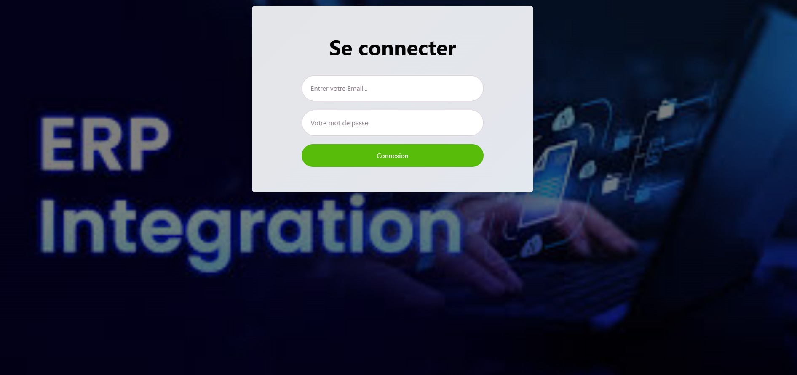
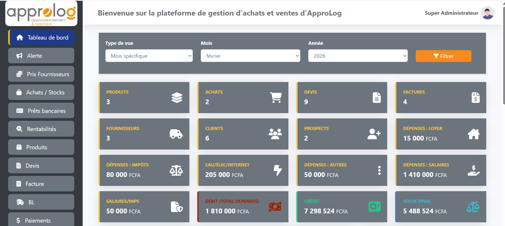
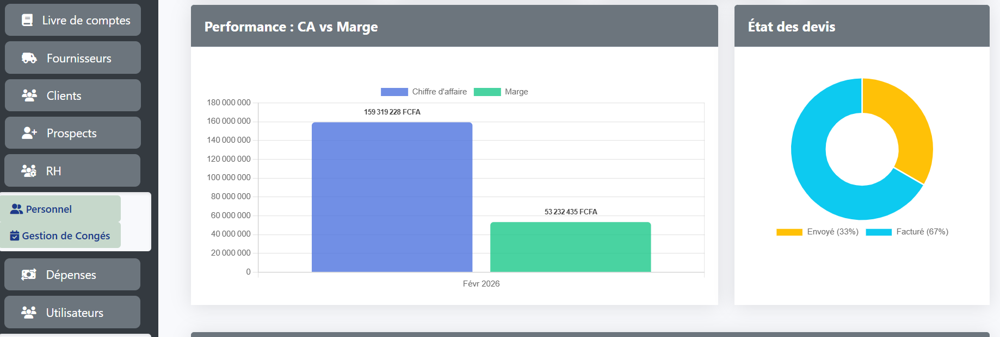
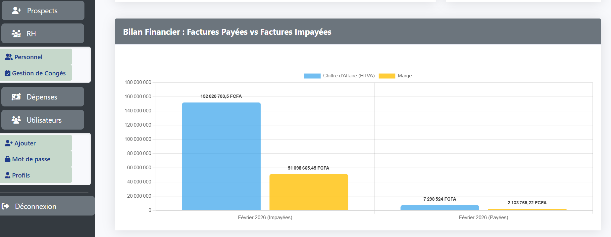

<p align="center">
    <a href="https://github.com/lassana99" target="_blank">
        
    </a>
</p>

<h1 align="center">ApproLogApp : ERP Intégré de Gestion Administrative & Opérationnelle</h1>

<p align="center">
    <strong>Une solution complète pour piloter la performance financière, commerciale et humaine d'une entreprise.</strong><br>
    <em>Développé avec Laravel 10, MySQL et Chart.js.</em>
</p>

---

## 📸 Aperçu de la Plateforme

### 🔐 Authentification Sécurisée
L'accès à la plateforme est protégé par un système d'authentification robuste. L'interface est conçue pour être intuitive et moderne dès la connexion.

<p align="center">
  
</p>

### 📊 Tableau de Bord Centralisé (Dashboard)
Le Dashboard offre une vue à 360° sur l'état de l'entreprise. Il permet de filtrer les données par mois et par année pour une analyse précise.

<p align="center">
  
</p>

**Indicateurs clés en temps réel :**
- **Flux de Trésorerie** : Calcul automatique du Crédit, Débit (Dépenses totales) et du Solde Final.
- **Dépenses Opérationnelles** : Suivi segmenté (Loyers, Impôts, Électricité/Internet, Salaires).
- **Activité Commerciale** : Compteur dynamique des Produits en stock, Achats, Devis générés et Factures émises.

---

## 🚀 Fonctionnalités Détaillées

### 💰 Analyse de la Performance & Rentabilité
Grâce à l'intégration de **Chart.js**, ApproLogApp transforme les données brutes en graphiques décisionnels.

<p align="center">
  
</p>

- **Bilan Financier** : Comparaison visuelle entre les factures payées et impayées pour une gestion optimale du recouvrement.
- **Suivi de la Marge** : Visualisation immédiate du Chiffre d'Affaires (HTVA) par rapport à la marge réelle pour chaque période.

### 📈 Pilotage Commercial & Statut des Ventes
Le système permet de suivre le cycle de vie de chaque transaction, du prospect à la facturation finale.

<p align="center">
  
</p>

- **État des Devis** : Un graphique circulaire (Doughnut chart) permet de voir la proportion des devis envoyés par rapport à ceux déjà convertis en factures.
- **Gestion des Partenaires** : Modules dédiés pour le suivi des Clients, Fournisseurs et Prospects avec historique des échanges.

### 👥 Gestion des Ressources Humaines (RH)
- **Personnel** : Fiches détaillées des employés et suivi des contrats.
- **Gestion des Congés** : Système de demande et d'approbation centralisé.
- **Paie** : Génération des bulletins de salaire et suivi des paiements INPS.

### 🚜 Maintenance & Rentabilité des Machines
- **Usure & Maintenance** : Suivi technique des équipements industriels.
- **Calcul de Rentabilité** : Analyse du coût d'exploitation par rapport aux revenus générés par chaque machine.

---

## 🛠️ Stack Technique

- **Framework** : [Laravel 10](https://laravel.com) (PHP 8.2)
- **Base de données** : MySQL (Relationnelle)
- **Frontend** : Blade Engine, Bootstrap 5, FontAwesome 6
- **Visualisation de données** : Chart.js
- **Gestion de fichiers** : DomPDF (Génération de factures et devis)
- **Tooling** : Vite.js, Composer

---

## ⚙️ Installation

```bash
# 1. Cloner le projet
git clone https://github.com/lassana99/projet-de-gestion-de-stock-et-administrative.git

# 2. Installer les dépendances
composer install
npm install && npm run dev

# 3. Configurer l'environnement
cp .env.example .env
php artisan key:generate

# 4. Migrer la base de données
php artisan migrate --seed

# 5. Lancer l'application
php artisan serve